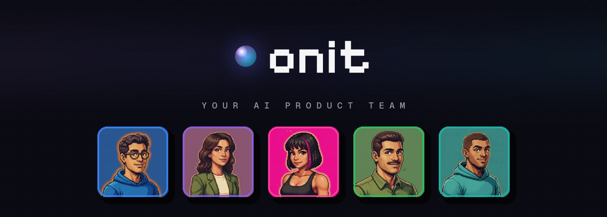

<div align="center">



<h3>Tell us your idea. We're on it.</h3>

<p><b>Onit turns a single brief into a real product plan, with an AI team that thinks <i>with</i> you, not just <i>for</i> you.</b></p>

<p>


</p>

<p><a href="https://onit-ai.vercel.app"><b>Live app →</b></a></p>

</div>

---

## What it is

Most "AI for product" tools hand you a wall of text and call it a PRD. Onit is
built around a different bet: a raw idea gets better when a *team* pushes on it.

You brief one idea. A coordinator ("Onit") reads the request and routes it to the
right specialists out of a five-role team. They do not just comply: they separate
what is **known** from what is **assumed** from what is **unknown**, name the
single riskiest assumption and the cheapest way to test it, then produce the real
artifact you came for. A PRD. User stories with acceptance criteria. A test plan.
A sprint plan. A user flow.

Everything the team settles (decisions, tasks, rules) stays with the project and
shapes every later answer, so the second question is smarter than the first.

## Meet the team

<table>
<tr>
<td align="center" width="20%"><br/><b>Analyst</b></td>
<td align="center" width="20%"><br/><b>Product Manager</b></td>
<td align="center" width="20%"><br/><b>Designer</b></td>
<td align="center" width="20%"><br/><b>Project Manager</b></td>
<td align="center" width="20%"><br/><b>QA</b></td>
</tr>
<tr>
<td align="center"><sub>Requirements, user stories, acceptance criteria</sub></td>
<td align="center"><sub>Strategy, PRDs, ruthless prioritization</sub></td>
<td align="center"><sub>UX flows, interaction, the interface</sub></td>
<td align="center"><sub>Sprints, sequencing, dependencies</sub></td>
<td align="center"><sub>Test strategy, edge cases, quality gates</sub></td>
</tr>
</table>

Coordinated by **Onit**, addressable in one chat. Mention a role directly with
`@analyst`, or let Onit pick. The team is deliberately five roles: no reflexive
"add an agent for everything".

## Why it is not just another LLM wrapper

As base models get better, a thin prompt wrapper loses its edge. Onit leans on
the things a fresh chat window structurally cannot do:

- **It challenges the idea.** Known / assumed / unknown, the riskiest assumption,
  the cheapest test. Opinion is labeled separately from evidence, and it never
  invents market data.
- **It remembers the project.** Adopted decisions, the backlog, and your rules are
  injected into every future prompt, so context compounds instead of resetting.
- **It answers with one voice.** When several roles contribute, Onit synthesizes a
  single decisive verdict first, with each teammate's raw output collapsed
  underneath. Less theater, more decision.
- **It produces buildable artifacts.** The output is a spec you can paste into
  Cursor, v0, or Lovable, not a transcript you have to clean up.

## How it works

```
your idea
   │
   ▼
[ Onit coordinator ]  gate + route  →  one role, or a justified multi-role plan
   │
   ▼
[ specialists ]  each answers in its lane, streamed token by token
   │
   ▼
[ synthesis ]  one decisive verdict, roles collapsed beneath it
   │
   ▼
[ project memory ]  decisions, tasks, and rules persist and shape what comes next
```

The whole loop runs on a streaming server (NDJSON over SSE): `meta` opens the
turn, `answer` deltas stream the text, `final` is authoritative, `done` closes it.

## Tech stack

| Layer | Choice |
| --- | --- |
| Framework | Next.js 16 (App Router, React 19, Server Actions) |
| Language | TypeScript, strict |
| Data + auth | Supabase (Postgres, Google OAuth, Row Level Security) |
| AI | Vercel AI SDK with a Google Gemini backend, model failover built in |
| UI | Tailwind CSS v4, Phosphor icons, a bespoke pixel-art team layer |
| Hosting | Vercel, auto deploy from `main` |

## Architecture

- **Coordinator + specialists.** A routing pass decides clarify vs work and picks
  roles; each role runs with a shared "product operating system" prompt layer plus
  its own persona, under security and reasoning guardrails that the admin panel
  cannot weaken.
- **Streaming state machine.** The SSE protocol is parsed by a pure, unit-tested
  state machine (`lib/chat/stream.ts`), decoupled from React.
- **Tiered context.** Recent turns stay full, older ones are summarized, and very
  old history collapses into a one-line project intro, all under a token budget.
- **Persistent memory.** Decisions, tasks, and rules live in Postgres and are
  re-injected into prompts on every request.
- **Guardrails.** Prompt-injection defenses are embedded in every system prompt,
  backed by lightweight in-process input and output filters.

## Getting started

```bash
git clone https://github.com/BatuhanAkpunar/OnitLLMChatBot.git
cd OnitLLMChatBot
npm install
cp .env.example .env.local   # fill in the values below
npm run dev                  # http://localhost:3000
```

Apply the schema in the Supabase SQL editor by running the files in
`supabase/migrations/` in order (`0001_init.sql` first), then seed the roles with
`0002_seed_agents.sql`.

### Environment variables

| Variable | Description |
| --- | --- |
| `NEXT_PUBLIC_SUPABASE_URL` | Supabase project URL |
| `NEXT_PUBLIC_SUPABASE_ANON_KEY` | Supabase anon / publishable key |
| `SUPABASE_SERVICE_ROLE_KEY` | Supabase service-role key (server only) |
| `GEMINI_API_KEY` | Google AI Studio API key |
| `GEMINI_DEFAULT_MODEL` | Chat model (default `gemini-2.5-flash`) |
| `GEMINI_FALLBACK_MODEL` | Failover model when the primary is overloaded |
| `NEXT_PUBLIC_SITE_URL` | App URL, used for the OAuth redirect |
| `ADMIN_EMAIL` | The email allowed to reach `/admin` |

Enable the **Google** provider under Supabase, Authentication, Providers, using a
Google Cloud OAuth client whose redirect URI is
`https://<project-ref>.supabase.co/auth/v1/callback`.

## Design language

The identity is neo-retro, "Pixel Atelier": an arcade, pixel-art team as a
secondary delight layer over a calm, premium main flow. Pixelify Sans is an accent
only (the wordmark and section headings), Geist carries the reading. There is one
motion vocabulary, not a grab bag: a single tactile press, one hover lift, one
scroll reveal, one easing curve, and `prefers-reduced-motion` respected
everywhere. Benchmarks for restraint: Linear, Notion, Raycast. The north star for
all of this lives in [`docs/PRODUCT.md`](docs/PRODUCT.md).

## Tests

```bash
npm test          # 47 unit tests: routing, streaming state machine, exports, more
npm run build     # type-check + production build
npm run eval:routing   # live routing eval against the model
```

## Status

Live at [onit-ai.vercel.app](https://onit-ai.vercel.app) and free to use. Actively
built. The working notes, product north star, and competitive research live under
[`docs/`](docs/).

---

<div align="center">
<sub>Built by <a href="https://github.com/BatuhanAkpunar">Batuhan Akpunar</a>. Personal project.</sub>
</div>
